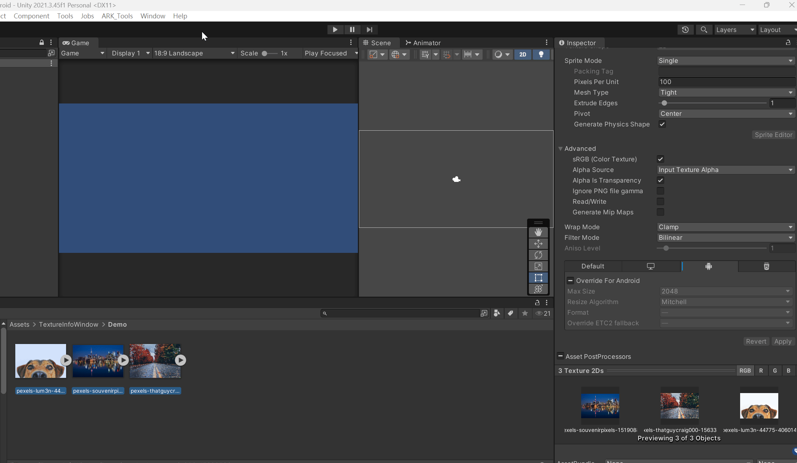
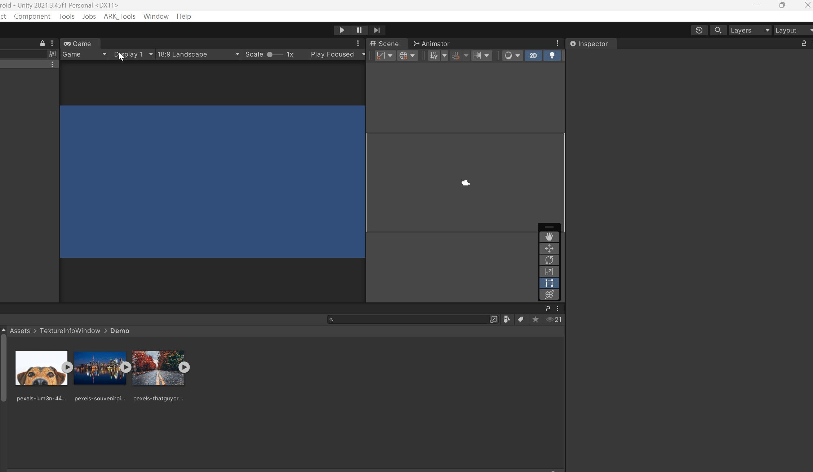

## 設定環境

需求:  
[OdinInspector](https://assetstore.unity.com/packages/tools/utilities/odin-inspector-and-serializer-89041)  
Unity 2021.3.45f1  
此專案內容不包含 Odin，請自行安裝  

---

## TextureViewer

**使用情境:**  
子資料夾過多，不想手動打開資料夾，一個一個確認圖片資料。  
可以用來一次性查看指定路徑底下的圖片格式，會在父資料夾內看到所有子資料夾的圖片格式。

---

## TextureBatchConvert

**使用情境:**  
設定好某個圖片後，某些資料夾底下所有圖片都會被轉換成設定好的圖片格式。  
營運遊戲常常會需要新增圖片資源，這時候只要設定好路徑，就可以一次轉換所有圖片。

參照圖片就是 ToPaths 路徑下，所有圖片都會照著這個圖片的格式轉換。  
GIF 展示設定好狗狗的圖片，並且 ToPaths 設定路徑為 `Demo` 資料夾。  
按下「更新所有目標圖片」後，另外兩個圖片也會隨著參照去更新格式。
